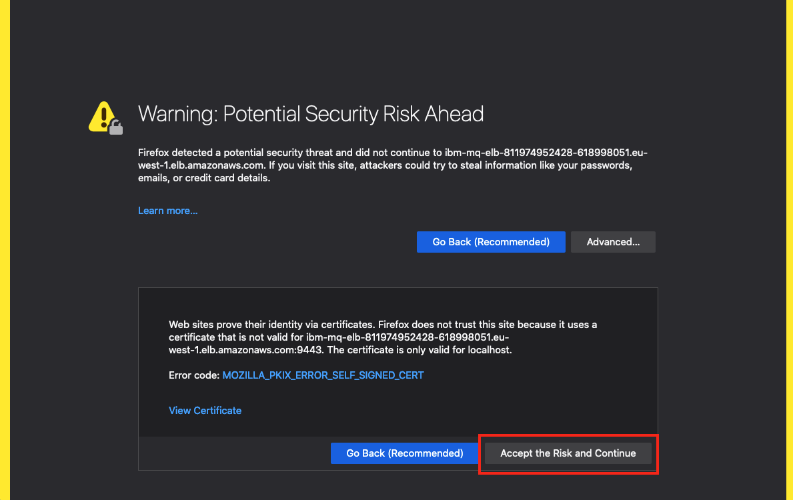
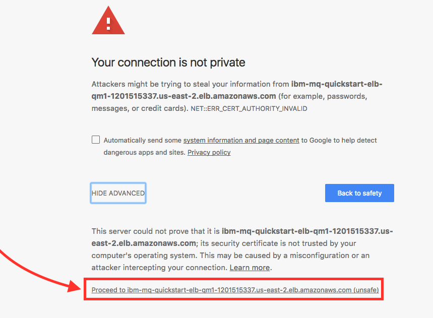
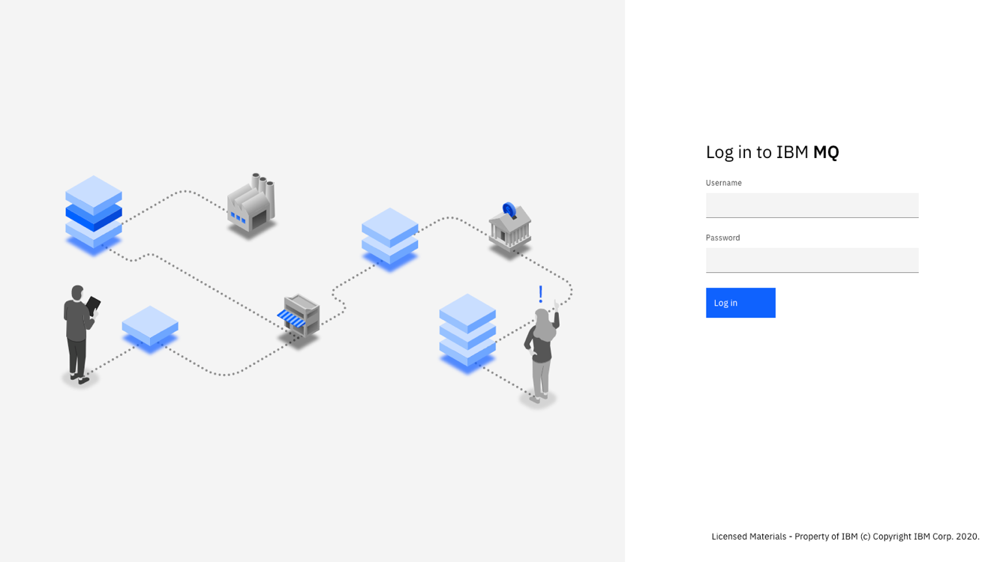
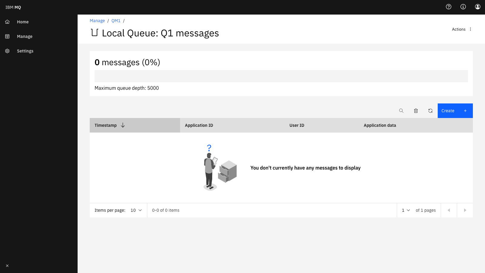
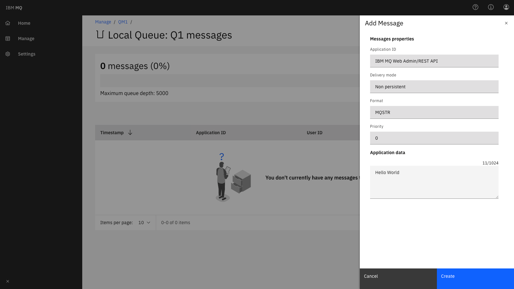
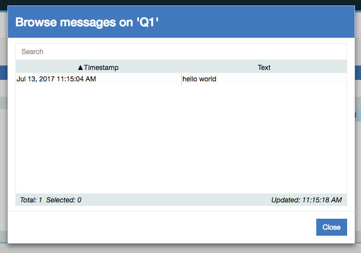

// Add steps as necessary for accessing the software, post-configuration, and testing. Don’t include full usage instructions for your software, but add links to your product documentation for that information.
//Should any sections not be applicable, remove them

== Test the deployment

When the AWS CloudFormation template has successfully created the stack, all server nodes will be running with the software installed in your AWS account.

In the following steps, you’ll connect to IBM MQ through a web console to verify the deployment, and then use the console to explore IBM MQ features.

To connect to IBM MQ through the web console:

. Choose the URL of the Elastic Load Balancing endpoint for the IBM MQ console. This is the URL highlighted in <<cfn_outputs>>.
. The https://www.ibm.com/support/knowledgecenter/en/SSAW57_liberty/com.ibm.websphere.wlp.nd.multiplatform.doc/ae/cwlp_about.html[Liberty server^] used by the MQ Console is initially configured to use a self-signed certificate, so your browser may display the warning shown in Figure 3. In the dialog box, choose *Advanced*, and then accept the security certificate to proceed.
+
We recommend that you update the self-signed certificate to a certificate that’s signed by a trusted CA. For more information about setting up certificates, see the https://www.ibm.com/support/knowledgecenter/en/SSFKSJ_9.0.0/com.ibm.mq.sec.doc/q127940_.htm[IBM MQ documentation^].
+
:xrefstyle: short
[#connection_error1]
.Connection error when accessing `MQConsoleURL`
[link=images/connection_error1.png]

+
:xrefstyle: short
[#connection_error2]
.Accepting the security certificate
[link=images/connection_error2.png]

+
[start=3]
. In the IBM MQ Console login screen, enter the user name and password you created during deployment. (The default user name is *mqconsoleadmin*.)
+
:xrefstyle: short
[#login_screen1]
.{partner-product-short-name} Console login screen
[link=images/login_screen.png]

+
The Console initially shows the default queue manager. If the status of the queue manager *QM1* (or the name you entered for the *Queue Manager Name* parameter in step 3) is *Running*, as shown in <<queue_manager1>>, then you have successfully deployed your queue manager.
+
:xrefstyle: short
[#queue_manager1]
.Displaying the local queue manager
[link=images/queue_manager.png]
image::../images/queue_manager.png[image,width=648,height=439]

You can use the IBM MQ Console to perform administration tasks such as stopping and starting queue managers and creating objects such as queues and channels. In the following steps, you’ll use the console to verify that the server is working correctly and add a message to a queue.

. In the console window, choose *Add widget*.
+
:xrefstyle: short
[#add_widget1]
.Adding a widget
[link=images/add_widget.png]

+
[start=2]
. In the *Add a new widget* dialog box, choose *Queues* to display the predefined queue, *Q1*.
+
:xrefstyle: short
[#add_widget2]
.Creating a queues widget
[link=images/create-queue-widget.png]
image::../images/create-queue-widget.png[image,width=634,height=500]
+
:xrefstyle: short
[#view-queue1]
.Viewing the predefined queue
[link=images/view-queue.png]

+
[start=3]
. On the toolbar, choose the envelope icon to put a test message on the queue.
+
:xrefstyle: short
[#env-icon1]
.Envelope icon
[link=images/envelope-icon.png]

+
:xrefstyle: short
[#place-message1]
.Placing a message in the queue
[link=images/place-message.png]

+
[start=4]
. On the *Queues on QM1* window toolbar, you can now choose the folder icon to browse the messages on the queue.
+
:xrefstyle: short
[#dir-icon1]
.Folder icon
[link=images/folder-icon.png]

+
:xrefstyle: short
[#browse-message1]
.Browsing messages on the queue
[link=images/browse-message.png]

For more information about using the https://www.ibm.com/support/knowledgecenter/en/SSFKSJ_9.0.0/com.ibm.mq.adm.doc/q127570_.htm[IBM MQ Console^], see the IBM Knowledge Center.

== Post deployment steps
=== Connect to the IBM MQ Server

It is possible to administer IBM MQ locally from the server. For more information about this option, see https://www.ibm.com/support/knowledgecenter/en/SSFKSJ_9.0.0/com.ibm.mq.adm.doc/q019950_.htm[Administering IBM MQ^] in the IBM Knowledge Center.

To connect to the IBM MQ server instance, use SSH to connect to the bastion host instance in your VPC. Use an SSH agent to forward your private key on connection. For more information about SSH agents, see the https://developer.github.com/v3/guides/using-ssh-agent-forwarding/[GitHub documentation^].

WARNING: Do not copy your private key to the bastion host instance.
