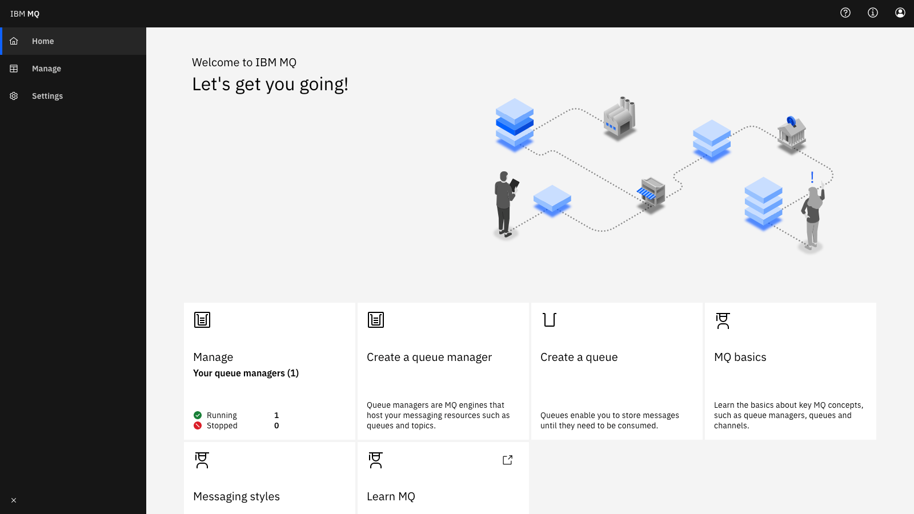
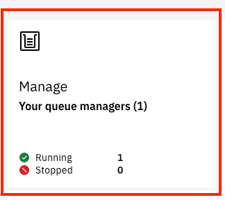

// Add steps as necessary for accessing the software, post-configuration, and testing. Don’t include full usage instructions for your software, but add links to your product documentation for that information.
//Should any sections not be applicable, remove them

== Test the deployment

When the AWS CloudFormation template successfully creates the stack, all server nodes run with the software installed in your AWS account.

In the following steps, you connect to IBM MQ through a web console to verify and explore the deployment.

Connect to the IBM MQ Console:

. Choose the URL of the Elastic Load Balancing endpoint for the IBM MQ Console, as shown in <<cfn_outputs>>.
. The https://www.ibm.com/support/knowledgecenter/en/SSAW57_liberty/com.ibm.websphere.wlp.nd.multiplatform.doc/ae/cwlp_about.html[Liberty server^] used by the IBM MQ Console is initially configured to use a self-signed certificate, so your browser may display the warning shown in <<connection_error1>>. Note that the screenshot was captured using Firefox v79.0; currently, Chrome v84.x does not allow users to bypass this warning.
+
We recommend that you update the self-signed certificate to a certificate that’s signed by a trusted certificate authority (CA). For more information about setting up certificates, see https://www.ibm.com/support/knowledgecenter/en/SSFKSJ_9.2.0/com.ibm.mq.sec.doc/q127940_.htm[Using client certificate authentication with the REST API and IBM MQ Console^].
+
:xrefstyle: short
[#connection_error1]
.Connection error when accessing `MQConsoleURL`
[link=images/connection_error1.png]
image::../images/connection_error1.png[image,width=648,height=439]
+
:xrefstyle: short
[#connection_error2]
.Accepting the security certificate
[link=images/connection_error2.png]
image::../images/connection_error2.png[image,width=648,height=439]
+
[start=3]
. On the IBM MQ Console login screen, enter the user name and password you created during deployment. (The default user name is *mqconsoleadmin*.)
+
:xrefstyle: short
[#login_screen1]
.{partner-product-short-name} Console login screen
[link=images/login_screen.png]
image::../images/login_screen.png[image,width=648,height=439]
+
The Console initially displays a landing page with quick links, as shown in <<landing_page1>>. Choose *Manage* to see the queue-management page, where you can create and edit queue managers. There are also quick links to *Create a queue manager* and *Create a queue*.
+
The *MQ Basics* tiles launch a short guide that describes some of the core concepts of messaging with IBM MQ, which is particularly useful if you are new to IBM MQ. There is also a link to the external *Learn MQ* website, where you can find tutorials and articles about IBM MQ.
+
:xrefstyle: short
[#landing_page1]
.{partner-product-short-name} Console landing page
[link=images/landing_page.png]

+
You can use the IBM MQ Console to perform administrative tasks, such as stopping and starting queue managers and creating objects in queues and channels. In the following steps, use the Console to verify that the server works correctly, and add a message to a queue.
+
[start=4]
. From the landing page, choose *Manage*.
+
:xrefstyle: short
[#manage_queue_page1]
.Manage queue page
[link=images/manage_queue_page.png]

+
[start=5]
. On the *Manage* page, choose *QM1* to open the queue manager (see <<queue_manager1>>).
+
:xrefstyle: short
[#queue_manager1]
.Viewing the queue manager details
[link=images/queue_manager.png]
image::../images/queue_manager.png[image,width=648,height=364]
+
[start=6]
. Open the *Q1* queue from the table to view it’s details. Local queues display a message viewer, which allows you to view, filter, and search messages.
+
:xrefstyle: short
[#view-queue1]
.Message viewer
[link=images/view-queue.png]
image::../images/view-queue.png[image,width=648,height=364]
+
[start=7]
. Choose *Create* to put a message in the queue. In the side panel, input a message in the *Application data* text field (see <<place-message1>>).
+
:xrefstyle: short
[#place-message1]
.Input message text in side panel
[link=images/place-message.png]
image::../images/place-message.png[put_message,width=648,height=364]
+
[start=8]
. Choose *Create* to put the message in the queue. The side panel closes, and the list view refreshes automatically.
+
:xrefstyle: short
[#browse-message1]
.Message appears in viewer
[link=images/browse-message.png]
image::../images/browse-message.png[browse_message,width=648,height=231]
+
For more information about using IBM MQ, see the https://www.ibm.com/support/knowledgecenter/en/SSFKSJ_9.2.0/com.ibm.mq.adm.doc/q127570_.htm[IBM Knowledge Center^].

== Post-deployment steps
=== Connect to the IBM MQ server

It's possible to administer IBM MQ locally from the server. For more information, see https://www.ibm.com/support/knowledgecenter/en/SSFKSJ_9.2.0/com.ibm.mq.adm.doc/q019950_.htm[Administering IBM MQ^].

To connect to the IBM MQ server instance, use SSH (Secure Shell) to connect to the bastion host instance in your VPC. Use an SSH agent to forward your private key upon connection. For more information, see https://developer.github.com/v3/guides/using-ssh-agent-forwarding/[Using SSH agent forwarding^].

WARNING: Do not copy your private key to the bastion host instance.
