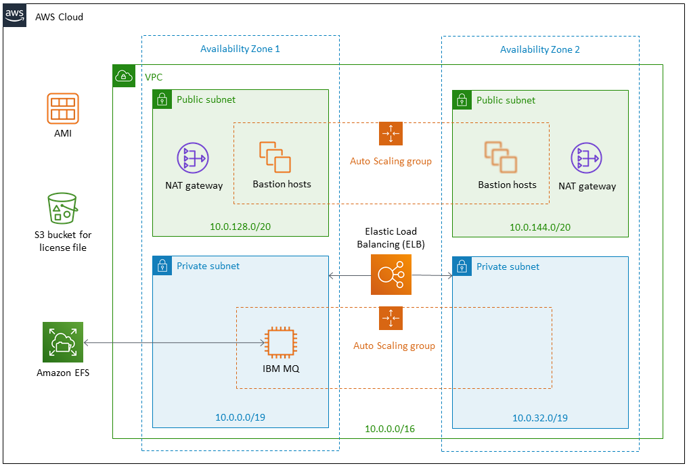

:xrefstyle: short

Deploying this Quick Start for a new virtual private cloud (VPC) with
default parameters builds the following _{partner-product-short-name}_ environment in the
AWS Cloud.

// Replace this example diagram with your own. Send us your source PowerPoint file. Be sure to follow our guidelines here : http://(we should include these points on our contributors giude)
[#architecture1]
.Quick Start architecture for _{partner-product-short-name}_ on AWS
[link=images/architecture_diagram.png]

As shown in <<architecture1>>, the Quick Start sets up the following:

* A virtual private cloud (VPC) that spans two Availability Zones and includes two public and two private subnets, for security and high availability.*
* An internet gateway to allow access to the internet.*
* In the public subnet, a bastion host to provide secure Secure Shell (SSH) access to the IBM MQ server. The bastion host is in an Auto Scaling group with its desired capacity set to one instance, which helps to ensure that one host is always available.*
* In the private subnet, an IBM MQ server in an Auto Scaling group with its desired capacity set to one instance.
* Amazon Elastic File System (Amazon EFS) automatically mounts the IBM MQ server instance for distributed storage to ensure high availability of the queue manager service and message data. If the IBM MQ server fails in one Availability Zone, a new server is created in a second Availability Zone and connects to the existing data so no persistent messages are lost. Failover typically takes 3–5 minutes but may be longer if there are outstanding transactions.
* Elastic Load Balancing to automatically distribute connections to the active IBM MQ server.
* An IAM instance role with resource-level permissions for access to AWS services necessary for the deployment process.
* Appropriate security groups for each instance or function to restrict access to only necessary protocols and ports. For example, access to HTTP server ports on Amazon EC2 servers is limited to Elastic Load Balancing.

*The template that deploys the Quick Start into an existing VPC skips
the components marked by asterisks and prompts you for your existing VPC
configuration.

[[design-considerations]]
=== Design considerations

IBM MQ provides a messaging platform that can be deployed with various options, depending on your needs. This Quick Start provides a starting point for building your messaging solution rapidly with IBM MQ on the AWS Cloud. The following sections discuss design considerations for large-scale deployments and options for optimizing performance.

To enhance availability and reliability for production workloads, this Quick Start uses two Availability Zones. This provides an automated failover from the primary server to a server that runs in a different Availability Zone, with no loss of message or configuration data.

The IBM MQ service supports client messaging applications (within your VPC) from trusted internet addresses and via a VPN from your on-premises environment.

[[ibm-mq-instances]]
==== IBM MQ instances

This deployment launches an EC2 instance using Ubuntu Linux x86-64. Elastic Load Balancing is used to automatically ensure that traffic is pointed to an active server. This deployment supports a selection of EC2 instance types for the IBM MQ server. Before you deploy a production instance, we recommend that you benchmark the environment to ensure that you achieve your required level of performance.

[[amazon-efs]]
==== Amazon EFS

Amazon EFS is a file storage service with an interface that allows you to create and configure file systems. Multiple EC2 instances can access an Amazon EFS file system at the same time, so this service provides a common data source for workloads and applications that run on more than one EC2 instance.

The default architecture built by this Quick Start allows for only one EC2 instance at a time to access your data.